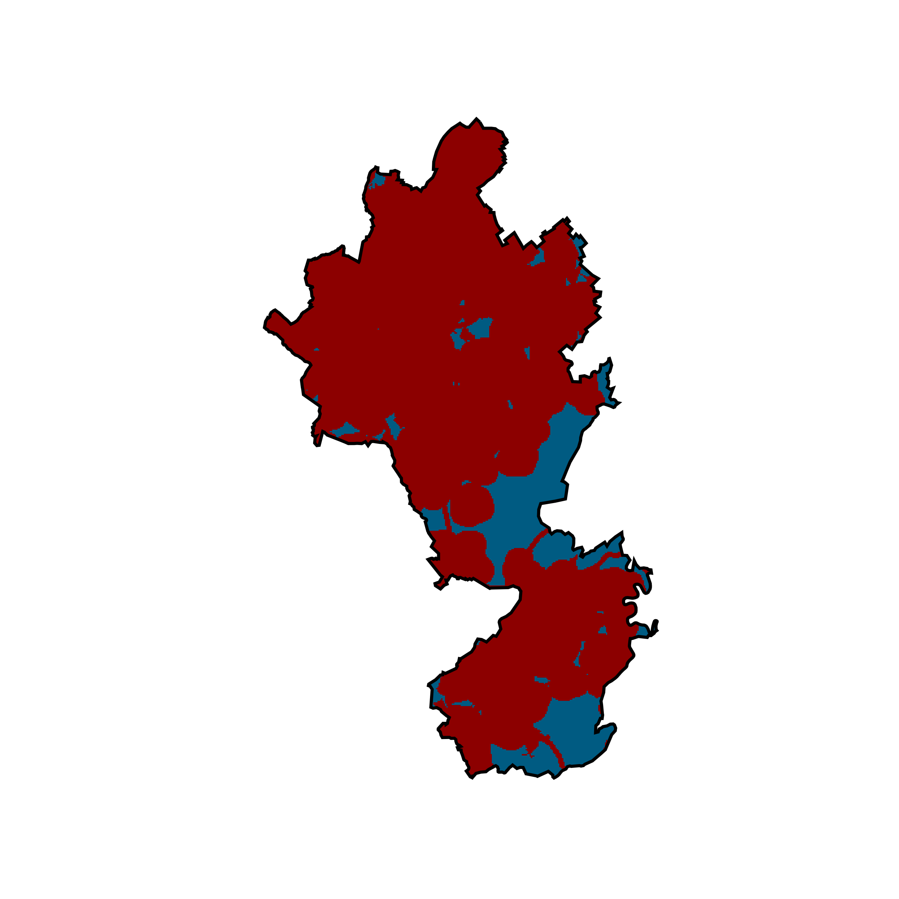

<a href="http://www.fz-juelich.de/iek/iek-3/EN/Forschung/_Process-and-System-Analysis/_node.html"></a> 

# Geospatial Land Availability for Energy Systems (GLAES)

GLAES is a framework for conducting land eligibility analyses and is designed to easily incorporate disparate geospatial information from a variety of sources into a unified solution.
Currently, the main purpose of GLAES is performing land eligibility (LE) analyses which, in short, are used to determine which areas within a region are deemed 'eligible' for some purpose (such as placing a wind turbine).
Although initially intended to operate in the context of distributed renewable energy systems, such as onshore wind and open-field solar parks, the work flow of GLAES is applicable to any context where a constrained indication of land is desired.
Except in the context of Europe, GLAES only provides a framework for conducting these types of analyses, and so the underlying data sources which are used will need to be provided.
Fortunately, GLAES is built on top of the Geospatial Data Abstraction Library (<a href="https://www.gdal.org">GDAL</a>) and so is capable of incorporating information from any geospatial dataset which GDAL can interpret; including common GIS formats such as .shp and .tif files.
In this way, GLAES affords a high degree of flexibility such that very specific considerations, while still maintaining a consistent application method between studies.

[](https://zenodo.org/badge/latestdoi/114907468)

## Features
* Standardized approach to land eligibility analyses
* Applicable in any geographic region and at any resolution
* Can flexibly incorporate most geospatial datasets: including the common .shp and .tif formats
* Simple visualization and storage of results as common image or raster dataset
* Simple integration of results into other analysis (via numpy array)


## European Priors

A number of precomputed (Prior) datasets which constitute the most commonly considered criteria used for LE analyses have been constructed for the European context.
These datasets are formatted to be used directly with the GLAES framework and, in doing so, drastically reduce the time requirements, data management, and overall complexity of conducting these analyses.
The Priors also have the added benefit of providing a common data source to all LE researchers, which further promotes consistency between independent LE evaluations.
Most important, usage of these datasets is just as easy as applying exclusions from other geospatial datasources.
Although the Prior datasets are not included when cloning this repository, they can be downloaded and installed using the process detailed in the "Installation" section.

---
## Example

### A simple LE work flow using GLAES would go as follows:
Objective:

* Determine land eligibility for photovoltaic (PV) modules in the <a href="https://en.wikipedia.org/wiki/Aachen_(district)">Aachen administration region</a> considering that...
    1. PV modules should not cover agricultural areas (because people need to eat)
    2. PV modules should not be within 200 meters of a major road way (because they may get dirty)
    3. PV modules should not be within 1000 meters of a settlement area (because they are too shiny)


```python
    ec = ExclusionCalculator(aachenRegion, srs=3035, pixelSize=100)
        
    ec.excludePrior("agriculture_proximity", value=0)
    ec.excludePrior("settlement_proximity", value=(None,1000))
    ec.excludePrior("roads_main_proximity", value=(None,200))
        
    ec.draw()
```



### More Examples
[Basic Workflow](Examples/00_basic_workflow.ipynb)

---
## Installation

Be sure the <a href="https://github.com/FZJ-IEK3-VSA/geokit">GeoKit</a> package is installed

Clone a local copy of the repository to your computer

    $ git clone https://github.com/FZJ-IEK3-VSA/glaes.git
    
Then install GLAES via pip as follow 
    
    $ cd <path>/glaes
    $ pip install -e .
    
If you would like to install the Prior datasets:
   * For now, contact the main author of this package for a download link (s.ryberg@fz-juelich.de)
   * Download the zipped file
   * Unzip the files directly into the glaes->data->priors directory
   * For instance...

    $ cp <path>/glaes/data/priors
    $ unzip priors.zip

---

## Associated papers

If you would like to see a **much** more detailed discussion on land eligibility analysis and see why a framework such as GLAES is not only helpful, but a requirement, please see:

<a href="the-background-paper">The Background Paper</a>

Examples of Land Eligibility evaluation and applications:

* [Determining the Land Eligibility of Renewable Energy Technologies with Application to European Wind Energy](link-will-go-here)

* [Spatio-Temporal Optimization of a Future Energy System for Power-to-Hydrogen Applications in Germany](link-will-go-here)

* [Linking the Power and Transport Sectors—Part 2: Modelling a Sector Coupling Scenario for Germany](http://www.mdpi.com/1996-1073/10/7/957/htm)

---
## Citation

If you decide to use GLAES anywhere in a published work, please kindly cite us using the following

```bibtex
@article{ryberg_land_eligibility_2017,
  title={Determining the Land Eligibility of Renewable Energy Technologies with Application to European Wind Energy},
  author={David Severin Ryberg, Zena Tulemat, Martin Robinius, Detlef Stolten},
  year={2017},
}
```

---
## License

MIT License

Copyright (c) 2017 David Severin Ryberg (FZJ IEK-3), Jochen Linßen (FZJ IEK-3), Martin Robinius (FZJ IEK-3), Detlef Stolten (FZJ IEK-3)

You should have received a copy of the MIT License along with this program.  
If not, see <https://opensource.org/licenses/MIT>

## About Us 
<a href="http://www.fz-juelich.de/iek/iek-3/EN/Forschung/_Process-and-System-Analysis/_node.html"></a> 

We are the [Process and Systems Analysis](http://www.fz-juelich.de/iek/iek-3/EN/Forschung/_Process-and-System-Analysis/_node.html) department at the [Institute of Energy and Climate Research: Electrochemical Process Engineering (IEK-3)](http://www.fz-juelich.de/iek/iek-3/EN/Home/home_node.html) belonging to the Forschungszentrum Jülich. Our interdisciplinary department's research is focusing on energy-related process and systems analyses. Data searches and system simulations are used to determine energy and mass balances, as well as to evaluate performance, emissions and costs of energy systems. The results are used for performing comparative assessment studies between the various systems. Our current priorities include the development of energy strategies, in accordance with the German Federal Government’s greenhouse gas reduction targets, by designing new infrastructures for sustainable and secure energy supply chains and by conducting cost analysis studies for integrating new technologies into future energy market frameworks.


## Acknowledgment

This work was supported by the Helmholtz Association under the Joint Initiative ["Energy System 2050 – A Contribution of the Research Field Energy"](https://www.helmholtz.de/en/research/energy/energy_system_2050/).

<a href="https://www.helmholtz.de/en/"></a>
