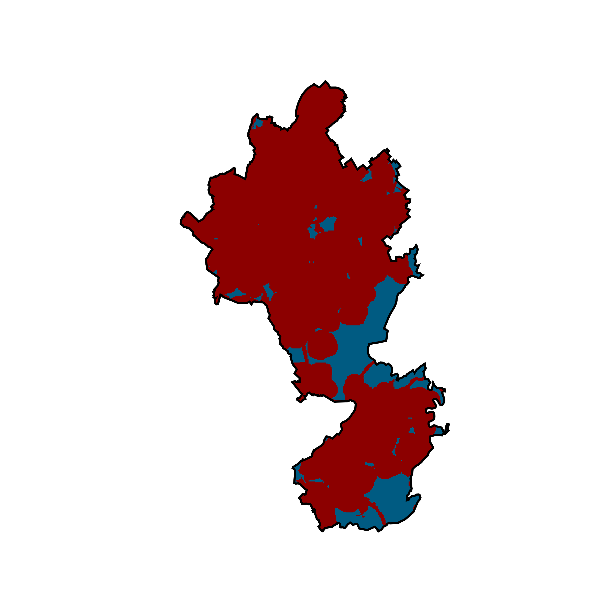

<p align="left">
  <a href="https://www.fz-juelich.de/en/ice/ice-2"></a>
</p>

# Geospatial Land Availability for Energy Systems (GLAES)

GLAES is a framework for conducting land eligibility analyses and is designed to easily incorporate disparate geospatial information from a variety of sources into a unified solution. The documentation can be found at: https://ethosglaes.readthedocs.io/

Currently, the main purpose of GLAES is performing land eligibility (LE) analyses which, in short, are used to determine which areas within a region are deemed 'eligible' for some purpose (such as placing a wind turbine).
Although initially intended to operate in the context of distributed renewable energy systems, such as onshore wind and open-field solar parks, the workflow of GLAES is applicable to any context where a constrained indication of land is desired.
Except in the context of Europe, GLAES only provides a framework for conducting these types of analyses, and so the underlying data sources which are used will need to be provided.
Fortunately, GLAES is built on top of the Geospatial Data Abstraction Library (<a href="https://www.gdal.org">GDAL</a>) and so is capable of incorporating information from any geospatial dataset which GDAL can interpret; including common GIS formats such as .shp and .tif files.
In this way, GLAES affords a high degree of flexibility for very specific considerations, while still maintaining a consistent application method between studies.

[](https://zenodo.org/badge/latestdoi/114907468)
[](https://codecov.io/gh/FZJ-IEK3-VSA/glaes)

## Features

- Standardized approach to land eligibility analyses
- Applicable in any geographic region and at any resolution
- Can flexibly incorporate most geospatial datasets: including the common .shp and .tif formats
- Simple visualization and storage of results as common image or raster dataset
- Simple integration of results into other analyses (via numpy array)

## European Priors

A number of precomputed (Prior) datasets which constitute the most commonly considered criteria used for LE analyses have been constructed for the European context.
These datasets are formatted to be used directly with the GLAES framework and, in doing so, drastically reduce the time requirements, data management, and overall complexity of conducting these analyses.
The Priors also have the added benefit of providing a common data source to all LE researchers, which further promotes consistency between independent LE evaluations.
Most importantly, usage of these datasets is just as easy as applying exclusions from other geospatial datasources.
Although the Prior datasets are not included when cloning this repository, they can be downloaded from [Mendeley Data](https://data.mendeley.com/datasets/trvfb3nwt2) and installed by unzipping (or placing if downloaded one-by-one) the files in the repo directory `glaes/data/priors`.

---

## Example

### A simple LE work flow using GLAES would go as follows:

Objective:

- Determine land eligibility for photovoltaic (PV) modules in the <a href="https://en.wikipedia.org/wiki/Aachen_(district)">Aachen administration region</a> considering that...
  1. PV modules should not cover agricultural areas (because people need to eat)
  2. PV modules should not be within 200 meters of a major roadway (because they may get dirty)
  3. PV modules should not be within 1000 meters of a settlement area (because they are too shiny)

```python
    ec = ExclusionCalculator(aachenRegion, srs=3035, pixelRes=100)
    ec.excludePrior("agriculture_proximity", value=0)
    ec.excludePrior("settlement_proximity", value=(None,1000))
    ec.excludePrior("roads_main_proximity", value=(None,200))
    ec.draw()
```



### More Examples

1. [Basic Workflow](Examples/00_basic_workflow.ipynb)
2. [Placement Algorithm](Examples/01_Placement_algorithm.ipynb)

---

## Installation

## Note 

GLAES is currently only tested against Linux machines. Although it is possible to install GLAES on Windows and macOS machines, the calculations may produce different results.

### Recommended installation

The recommended way to install GLAES is to use the conda package manager. This will ensure that all dependencies are installed correctly and that the package is compatible with your system.

Using the conda package manager of your choice (we recommend [miniforge](https://github.com/conda-forge/miniforge)), you can install GLAES with the following command:

```bash
conda install -c conda-forge glaes
```

If you are installing GLAES into an environment using an environment.yml file, make sure to add the conda-forge channel to the file:

```yaml
channels:
  - conda-forge
dependencies:
  - conda-forge::glaes
```

However, we **highly recommend** that you install the package into a new, empty environment, as the dependencies of GLAES may conflict with other packages you have installed. We are currently working on a new release which will be compatible with later versions of GDAL (>3.0).

### Development Installation


GLAES is closely linked to GeoKit. If you intend to develop GLAES, it is also recommended to install GeoKit in development mode into the same environment.

1. First clone a local copy of both repositories to your computer:

```
git clone https://github.com/FZJ-IEK3-VSA/glaes.git
git clone https://github.com/FZJ-IEK3-VSA/geokit.git
```

2. Combine the dependencies of GLAES's `requirements-no-geokit.yml` and GeoKit's `requirements.yml` into a new `requirements-combined.yml`. GLAES ships a dedicated `requirements-no-geokit.yml` that intentionally omits the conda-forge `geokit` package, so it does not shadow the editable GeoKit you install from source in step 5.

3. Create the new environment with all conda-forge dependencies:

```
conda env create --file requirements-combined.yml -n glaes_dev_env
```

4. Activate the environment:

```
conda activate glaes_dev_env
```

5. Install the local libraries:

```
pip install -e ./geokit --no-deps
pip install -e ./glaes --no-deps
```

---

## Associated papers

If you would like to see a **much** more detailed discussion on land eligibility analysis and see why a framework such as GLAES is not only helpful, but a requirement, please see:

<a href="https://www.mdpi.com/1996-1073/11/5/1246#B21-energies-11-01246">The Background Paper</a>

Examples of Land Eligibility evaluation and applications:

- [Uniformly constrained land eligibility for onshore European wind power](https://doi.org/10.1016/j.renene.2019.06.127)

- [The techno-economic potential of offshore wind energy with optimized future turbine designs in Europe](https://doi.org/10.1016/j.apenergy.2019.113794)

- [Linking the Power and Transport Sectors—Part 2: Modelling a Sector Coupling Scenario for Germany](http://www.mdpi.com/1996-1073/10/7/957/htm)

---

## Example applications of external institutions

- [Cost-potential curves of onshore wind energy including disamenity costs](https://link.springer.com/article/10.1007/s10640-022-00746-2) 

---
  
## Citation

If you decide to use GLAES anywhere in a published work, please kindly cite us using the following.

```bibtex
@article{Ryberg2018,
  author = {Ryberg, David and Robinius, Martin and Stolten, Detlef},
  doi = {10.3390/en11051246},
  issn = {1996-1073},
  journal = {Energies},
  month = {may},
  number = {5},
  pages = {1246},
  title = {{Evaluating Land Eligibility Constraints of Renewable Energy Sources in Europe}},
  url = {http://www.mdpi.com/1996-1073/11/5/1246},
  volume = {11},
  year = {2018}
}
```

---

## License

MIT License

Copyright (c) 2017-2026 David Severin Ryberg (FZJ IEK-3), Jochen Linßen (FZJ IEK-3), Martin Robinius (FZJ IEK-3), Detlef Stolten (FZJ IEK-3)

You should have received a copy of the MIT License along with this program.  
If not, see <https://opensource.org/licenses/MIT>

## About Us 

We are the <a href="https://www.fz-juelich.de/en/ice/ice-2">Institute of Climate and Energy Systems – Jülich Systems Analysis (ICE-2)</a> at the <a href="https://www.fz-juelich.de/en"> Forschungszentrum Jülich</a>.
Our work focuses on independent, interdisciplinary research in energy, bioeconomy, infrastructure, and sustainability. We support a just, greenhouse gas–neutral transformation through open models and policy-relevant science.


## Acknowledgment

This work received primary support from the Helmholtz Association through the Joint Initiative ["Energy System 2050: A Contribution of the Research Field Energy"](https://www.helmholtz.de/en/research/energy/energy_system_2050/) and the program ["Energy System Design"](https://www.helmholtz.de/en/research/research-fields/energy/energy-system-design/). Additionally, parts of this work were supported by the [H2Atlas-Africa project (03EW0001)](https://www.fz-juelich.de/de/ice/ice-2/projekte/h2-atlas-africa), funded by the German Federal Ministry of Research, Technology, and Space (BMFTR).


<a href="https://www.helmholtz.de/en/">
  <picture>
    <source media="(prefers-color-scheme: dark)" srcset="https://raw.githubusercontent.com/FZJ-IEK3-VSA/README_assets/v.1.0.0/Helmholtz_Logos/Helmholtz-Logo-White-RGB.svg">
    <source media="(prefers-color-scheme: light)" srcset="https://raw.githubusercontent.com/FZJ-IEK3-VSA/README_assets/v.1.0.0/Helmholtz_Logos/Helmholtz-Logo-Dark-Blue-RGB.svg">
    
  </picture>
</a>

